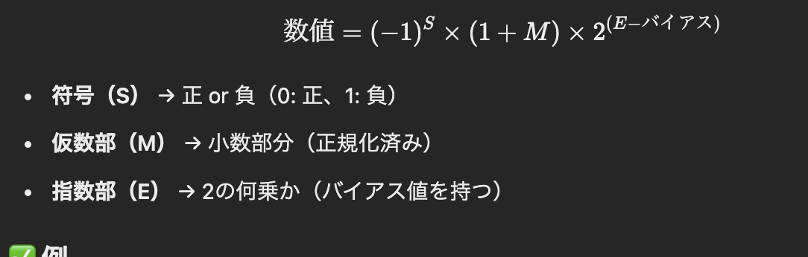
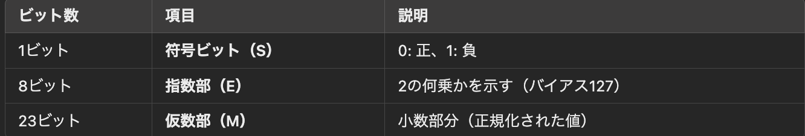
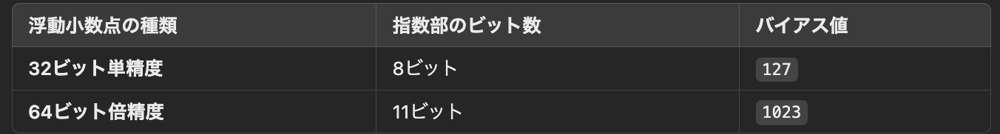

# 固定小数点数と浮動小数点数

## 📌 固定小数点数（Fixed-point）

### ✅ 固定小数点とは？
**固定小数点数** とは、小数点の位置を **固定** したまま数値を表現する方法です。

- **整数として格納し、スケール（倍率）で小数を表現する**
- **整数演算で処理できるため、高速で誤差が少ない**
- **組み込みシステム、金融システムなどでよく使われる**

### ✅ 例
例えば、「小数点2桁固定」の場合：
- **整数値 `1234` を使うと、実際の値は `12.34`**
- **整数値 `56789` なら、実際の値は `567.89`**

固定小数点（スケール = 100）
整数値: 1234   → 実際の値: 12.34
整数値: 56789  → 実際の値: 567.89

✅ 固定小数点のメリット・デメリット
項目	固定小数点
計算速度	速い（整数演算）
精度	高い（丸め誤差がない）
表現範囲	限られる（事前に桁数を決める必要）
用途	組み込みシステム、金融システム

📌 浮動小数点数形式（Floating-point）
✅ 浮動小数点とは？
浮動小数点数 は、小数点の位置を 可変（浮動） にすることで、広い範囲の数を効率的に表現する方法です。

✅ 仕組み
浮動小数点数は、次の式で表されます。

✅ 例
10進数 5.75 を浮動小数点数に変換すると：

2進数に変換
5.75₁₀ = 101.11₂
正規化
1.0111₂ × 2^2
IEEE 754のフォーマットに当てはめる
符号（S） = 0
指数（E） = 2 + 127 = 129（10000001₂）
仮数（M） = 01110000000000000000000
IEEE 754の 32ビット表現：0 10000001 01110000000000000000000

📌 浮動小数点数の正規化
✅ 正規化とは？
浮動小数点数は 「1.xxxxx × 2^n」 の形に正規化することで、精度を最大限に保ちます。

✅ 正規化の例
10進数 12.5₁₀ を 2進数にすると：1100.1₂

これを正規化すると：1.1001₂ × 2^3

正規化によって、仮数部の先頭が常に 1 になるため、IEEE 754では 最上位の 1 を省略 して格納します。

📌 IEEE 754の形式例とバイアス値
✅ IEEE 754（32ビット単精度浮動小数点）
IEEE 754の32ビット浮動小数点数は、次の3つの部分で構成されます。

✅ バイアス値とは？
指数部 E には バイアス（基準値） を加えて格納します。

指数 n を格納するには、バイアスを加えて E = n + 127（32ビットの場合）とします。

✅ IEEE 754の具体例
10進数 -7.5 をIEEE 754の32ビット形式に変換

2進数に変換:
-7.5₁₀ = -111.1₂
正規化:
-1.111 × 2^2
符号（S） = 1（負の数）
指数（E） = 2 + 127 = 129（10000001₂）
仮数（M） = 11100000000000000000000
IEEE 754表現：
1 10000001 11100000000000000000000

📌 まとめ
✅ 固定小数点数 は、小数点の位置を固定し、整数演算で高速に計算可能。
✅ 浮動小数点数 は、小数点の位置を自由に変えられ、広い範囲の数を扱える。
✅ IEEE 754では「符号 + 指数 + 仮数」で表現し、指数にはバイアス値が加えられる。
✅ 浮動小数点数の正規化により、仮数部の最上位ビットは省略される。