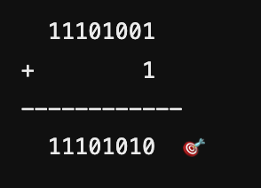

# 🌟 10進数 -5.625 を 8ビット固定小数点形式で表す方法 🌟

`-5.625` を **8ビット固定小数点形式** で表す方法！

---

## 🟢 1. まず、固定小数点のルールを確認！

🔹 **「小数点位置は3ビット目と4ビット目の間」** って書いてあるね。  
👉 つまり、小数点は **「●●●.●●●●」** の形になるよ！

🔹 **「負の数は 2の補数で表す」** ってあるね。  
👉 負の数を表すときは、**「まず正の数を求めて、最後に2の補数に変換」** するよ！

---

## 🟢 2. まず、-5.625 の正の形（5.625）を 2進数にする

### ① 10進数 `5.625` を 2進数に変換
整数部分と小数部分を別々に変換するよ！✨

#### 🔸 **整数部分 `5₁₀` を 2進数に！**
`5₁₀` を 2進数にすると `101₂` になるよ！💡

#### 🔸 **小数部分 `0.625₁₀` を 2進数に！**
小数部分は `0.625 × 2` を繰り返して変換するよ！

| 計算 | 整数部分 | 小数部分 |
|---|---|---|
| `0.625 × 2 = 1.25` | `1` | `0.25` |
| `0.25 × 2 = 0.5` | `0` | `0.5` |
| `0.5 × 2 = 1.0` | `1` | `0.0`（終了！） |

だから、`0.625₁₀ = 0.101₂` だね！🎉

---

## 🟢 3. 小数点の位置に合わせて並べる！
`5.625₁₀ = 101.101₂` だから、  
**「小数点位置は 3ビット目と4ビット目の間」** に合わせると…

👉 これを **8ビットで表す** と `00010110` になるよ！🎯

---

## 🟢 4. 負の数（-5.625）にするために、2の補数を求める！

**2の補数** とは、「すべてのビットを反転（0↔1）して `+1` する」こと！

#### 🔸 **① `00010110` をビット反転**　　　　　  00010110  →  11101001

#### 🔸 **② `+1` する**　　　　　　　

だから、`-5.625₁₀` は `11101010₂` になる！

---

## 🟢 5. 選択肢から探す！
選択肢を見ると…

---

## 🟢 まとめ
💡 **固定小数点の計算手順を簡単に復習！**
1. **正の値を2進数にする**（整数・小数に分ける）
2. **小数点位置を指定通りに調整する**
3. **負の数なら2の補数に変換する**
4. **選択肢と照らし合わせて答えを選ぶ**

---

