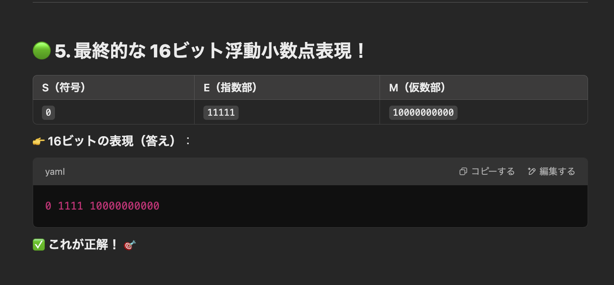

# 🌟 16ビットの浮動小数点形式で 0.25 を表す方法 🌟

## 🟢 問題
**16ビットの浮動小数点形式** で **10進数 0.25** を **正規化** した表現を求める。

📌 **正規化とは？**  
👉 仮数部の最上位の桁（ビット）が `0` にならないように、指数部と仮数部を調整すること！

---

## 🟢 1. まず、`0.25₁₀` を **2進数に変換！**
### 🔹 小数を2進数にする方法  
`0.25` を 2進数にするために **2を掛けて整数部分を取り出す** 方法を使うよ！  

| 計算 | 整数部分 | 小数部分 |
|---|---|---|
| `0.25 × 2 = 0.5` | `0` | `0.5` |
| `0.5 × 2 = 1.0` | `1` | `0.0`（終了！） |

👉 **結果**：  
0.25₁₀ = 0.01₂

🟢 2. 正規化する！（仮数部を 1.xxx の形にする）
今の 0.01₂ を、仮数部の 最上位が 1 になるように 変形するよ！

0.01₂ = 1.0 × 2⁻¹

👉 これが 「正規化」 された形！（1.0 × 2⁻¹）

🟢 4. 各部分を求める！
🔹 符号（S）
0.25 は 正の数 だから、S = 0 ！

🔹 指数部（E）
指数部 -1 を バイアス（15） で調整するよ！

E = -1 + 15 = 14

👉 14₁₀ を 5ビットの2進数（2の補数） にすると：14₁₀ = 11111₂

🔹 仮数部（M）
正規化した 1.0 × 2⁻¹ の 小数部分（1.0の「.0」部分） を 10ビット にする。
1.0 → 0000000000 （10ビット）

